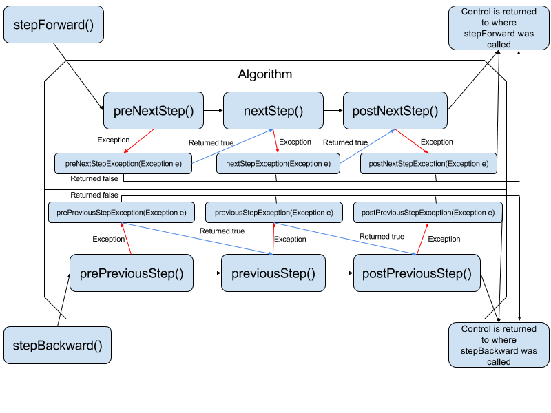
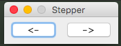

# Algorithm Stepper
_Created by [Jackson Zavarella](https://www.linkedin.com/in/jackson-zavarella-040183133/)_

This package provides the basic tools to be able to run any algorithm forward or backwards one step at a time.
You must write your algorithm according to the [Algorithm Interface](#algorithm-interface) and then use the [Algorithm Stepper](#algorithm-stepper-1) or [Algorithm Stepper UI](#algorithm-stepper-ui) to step through the algorithm.

### [Algorithm Interface](https://github.com/jzavarella/AlgorithmStepper/blob/master/src/main/java/algorithm/Algorithm.java)
This is the interface for an algorithm which can be executed one step/cycle at a time.
The interface has two main functions:
 1. Stepping the algorithm being implemented forward once
 2. Stepping the algorithm being implemented backward once

A single step of the algorithm being implemented follows the following lifecycle (Note that all of these methods exist for each next and previous step functions):
 *  First the pre-step method is executed.
 *  Then the step method is executed.
 *  Finally the post-step method is executed.

If there is an exception in any of the above stages, the corresponding exception method is executed and the user can choose whether to continue through the lifecycle by returning true or false from the exception method.

An example implementation for and algorithm to calculate numbers of the fibonacci sequence can be found [here](https://github.com/jzavarella/AlgorithmStepper/blob/master/src/main/java/algorithm/implementations/Fibonacci.java).

### [Algorithm Stepper](https://github.com/jzavarella/AlgorithmStepper/blob/master/src/main/java/algorithm/stepper/AlgorithmStepper.java)
This class handles the life cycle of an algorithm. It has two main functions, stepping forward and backwards in the algorithm. While stepping forward or backward, the appropriate algorithm pre and post steps are called and in the event of an exception, the appropriate exception method is called.

#### AlgorithmStepper Lifecycle

This flowchart shows how the algorithm stepper executes the algorithm one step at a time.


#### Usage
```java
class TestClass {
    public static void main(String[] args) {
        Algorithm fibonacci = new Fibonacci(); // Instantiate an implementation of the Algorithm Interface
        AlgorithmStepper stepper = new AlgorithmStepper(fibonacci); // Instantiate an AlgorithmStepper passing an Algorithm to it
        
        stepper.stepForward(); // Will output '1'
        stepper.stepForward(); // Will also output '1' because the first two elements of the fibonacci sequence are 1
        stepper.stepForward(); // Will output '2'
        stepper.stepForward(); // Will output '3'
        
        stepper.stepBackward(); // Will step back in the algorithm and output '2' because two is the previous element
        
        System.out.println(stepper.toString()); // Will output '[1, 1, 2]' toString calls the toString of the Algorithm and in the case of the fibonacci Algorithm implementation it returns the sequence of numbers generated so far
    }
}
```

### Algorithm Stepper UI
This package also includes a graphical UI wrapper for the [Algorithm Stepper](#algorithm-stepper-1)
The AlgorithmStepperUI extends JFrame.

#### Usage
The usage of the UI similar to the [Algorithm Stepper](#algorithm-stepper-1)

```java
class TestClass {
    public static void main(String[] args) {
        Algorithm fibonacci = new Fibonacci(); // Instantiate an implementation of the Algorithm Interface
        AlgorithmStepperUI ui = new AlgorithmStepperUI(fibonacci); // Instantiate an AlgorithmStepperUI passing an Algorithm to it
        
        ui.setVisible(true); // The AlgorithmStepperUI is a JFrame and must be set to visible
    }
}
```



Running the above code will open a JFrame with a forward and backward button which when clicked will traverse the algorithm forward or backward.

